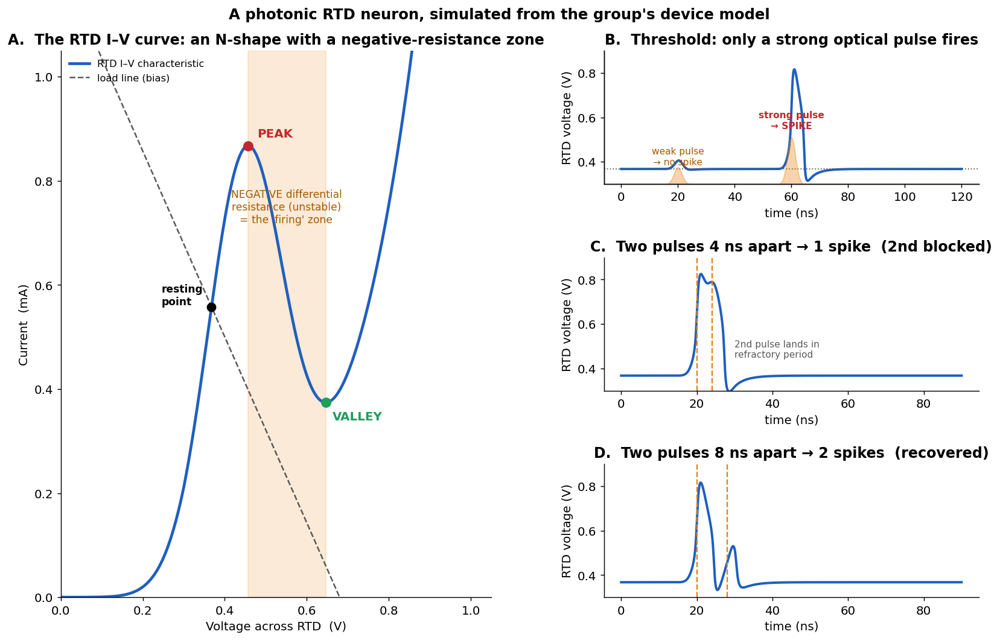
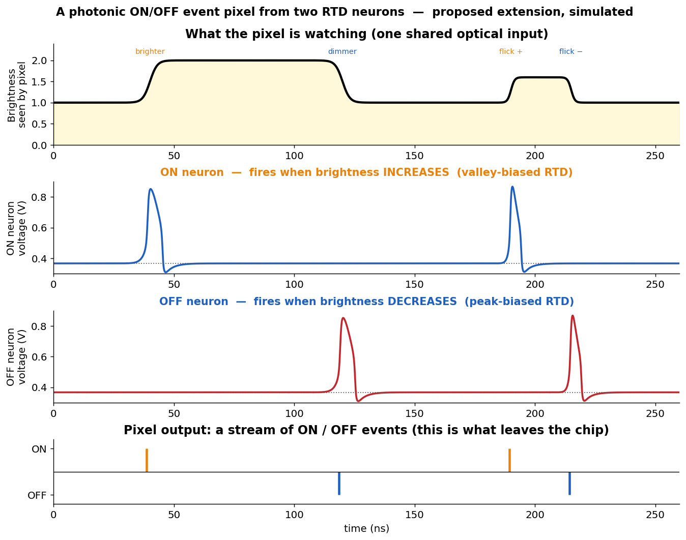

# A Photonic ON/OFF Event Pixel from RTD Neurons

A small, self-contained simulation study exploring whether two resonant-tunnelling-diode
(RTD) photonic neurons can be combined into a single **ON/OFF event pixel** — the photonic
analogue of an electronic Dynamic Vision Sensor (DVS) pixel — on a heterogeneously
integrated InP-on-silicon platform.

Built as a personal exploration while reading the RTD photonic-neuron literature. It runs on
a laptop in seconds and reproduces the published single-neuron behaviour before proposing one
modest extension.

---

## The idea in one paragraph

A single RTD neuron biased **below** its I–V peak fires an excitable spike when the incident
optical power **increases**; biased **above** the peak, it fires when the optical power
**drops**. Both behaviours are already reported in the RTD-neuron literature. This project
simply **combines** them: one shared, change-sensing optical front-end drives two
complementary neurons, so the pixel emits a proper **ON** event when brightness rises and an
**OFF** event when it falls — with silence in between. Tiled into an array, this is an
all-photonic event camera front-end running at nanosecond timescales.

## Honest framing (what is and isn't new here)

This is an **architecture / integration proposal**, not a claimed physical discovery. The
individual ingredients already exist:

- RTD neurons showing excitable spiking, a firing threshold, and a refractory period.
- A single RTD detecting optical **increases** (valley bias) and optical **drops** (peak bias).
- Excitatory and inhibitory RTD-neuron operation.
- ON/OFF event polarity itself — standard in electronic (CMOS) event cameras for years.

What I could not find in the literature (I may well have missed it) is these single-device
behaviours assembled into **one polarity-resolved event *pixel* on the InP-on-silicon
heterogeneous-integration platform**, together with the pixel-level figures of merit needed
to judge it (photons per event, false-event rate, contrast sensitivity, refractory-limited
event rate). That gap is what this repo pokes at.

## What's in here

| File | What it does |
|------|--------------|
| `rtd_neuron.py` | The RTD neuron: N-shaped I–V + circuit ODEs. Reproduces threshold, ns-scale spiking, refractory period. |
| `rtd_event_pixel.py` | Two complementary neurons + a shared change-sensing front-end = the proposed ON/OFF pixel. |
| `make_figures.py` | Regenerates both figures below from the models. |
| `figures/` | Output figures. |
| `requirements.txt` | numpy, scipy, matplotlib. |

## Results

**1. A single RTD neuron behaves like a spiking neuron.** Weak optical input → nothing; strong
input → one spike that returns to rest; a second input too soon → blocked (refractory period).



**2. Two of them form an ON/OFF event pixel.** From one shared optical input, the pixel stays
silent until brightness changes, then emits an ON event (brightening) or OFF event (dimming)
at exactly the right moment.



## Run it

```bash
pip install -r requirements.txt
python make_figures.py      # regenerate both figures
python rtd_neuron.py        # print single-neuron threshold / spike stats
python rtd_event_pixel.py   # print the ON/OFF event stream
```

## Limitations (deliberately kept honest)

- The RTD I–V shape and the circuit values (C, L, R, bias) are **representative** — chosen to
  reproduce the *qualitative* behaviour of a real device (N-shape, PVCR ≈ 2.3, ns spikes), not
  fitted to any specific fabricated device.
- In `rtd_event_pixel.py` the OFF channel is modelled as an identical neuron driven by the
  opposite-sign change signal. In real hardware the OFF channel would instead be an RTD biased
  above its I–V peak, which fires directly on optical drops — the same rectifying behaviour,
  achieved physically rather than in software.
- The shared front-end responds to the rate of change of brightness (a change detector, as in
  a DVS pixel). Quantum-dot pre-amplification — central to sensitivity in the real platform —
  is not modelled here; it is where few-photon operation would come from.

## Background / references

RTD photonic-neuron work (Strathclyde / INL / consortium), which this study builds directly on:

- Owen-Newns, Robertson, Donati, Figueiredo, Wasige, Lüdge, Romeira, Hurtado,
  *Neuromorphic Photonic Processing and Memory with Spiking Resonant Tunnelling Diode Neurons
  and Neural Networks* (2025). — source for valley→increase, peak→drop, edge detection.
- Hejda et al., *Photonic-electronic spiking neuron with multi-modal and multi-wavelength
  excitatory and inhibitory operation for high-speed neuromorphic sensing and computing*,
  Neuromorphic Computing and Engineering (2023).

Heterogeneous InP-on-Si integration — the platform this proposal targets — is the specialty of
the Photonic Integration (PhI) group at TU/e.

---

*Author: Vaishnavi — exploratory project, 2026.*
